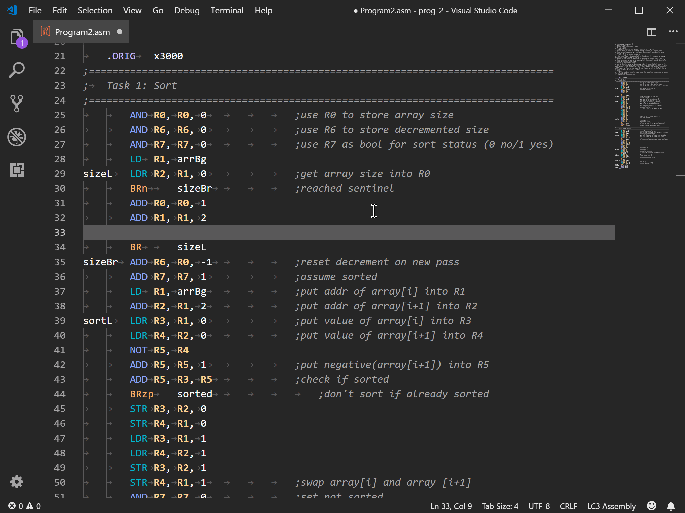

# LC3 Assembly Extension

Basic syntax highlighting and snippets for the LC3 assembly language used by 
the UT ECE department for Introduction to Computing EE 306. Integrates with the 
[laser](https://github.com/PaperFanz/laser) assembler, also written by me for 
the express purpose of offering a less restrictive option for more advanced 
students.

## Features

* Integration with [laser](https://github.com/PaperFanz/laser) for in-editor 
assembling

* Syntax hihglighting for different types of operations. Registers are bolded 
and highlighted (So you know whether you've typed R0 or RO).

* Snippet support for all LC3 opcodes excluding RTI (because you don't need a 
snippet to type RTI), including different addressing modes where appropriate.

## Usage

Assemble: Open the command palette and type `assemble` or use `alt+shift+a`, 
then select the file(s) you want to assemble from the open file dialog

Assemble Project: Open the command palette and type `assemble project` or use 
`alt+shift+p`, then select the files you want to assemble as a projectfrom the 
open file dialog

Assemble Folder: Open the command palette and type `assemble current directory` 
or use `alt+shift+d`

Assemble Folder as Project: Open the command palette and type `assemble current 
directory as project` or use `alt+shift+b`

After installing the extension via the extension marketplace and reloading the 
active window to activate it, just begin typing your code. The VSCode suggestion
 window will pop up and you can use the arrow keys to select an option or keep 
typing to further refine the suggestions. Press tab to cycle through the 
highlighted default spaces, and type in your registers, immediate values, 
offsets, labels, etc.

## Requirements

VSCode 1.18.0 or up.

## Known Issues

Windows users should make sure that their default shell is set to either 
wsl.exe or powershell.exe and that laser has been properly installed on 
whichever shell your integrated terminal defaults to.

## Changelog

See [CHANGELOG.md](CHANGELOG.md)

**Enjoy!**
